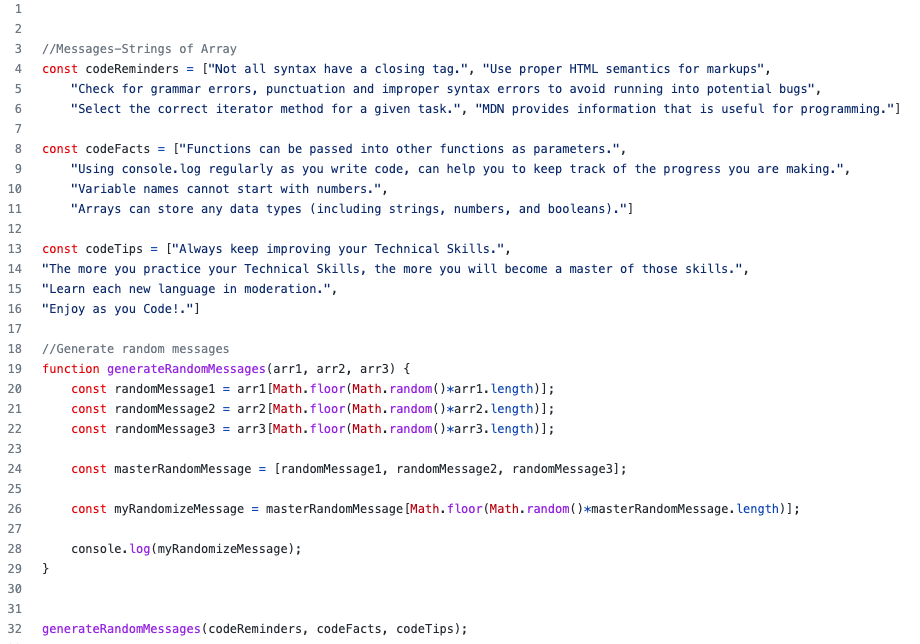

Welcome! 

# Code Reminder Generator

## What does this project do?
This program randomly generates code messages each time the program is run. 

> I am Anita, a student at Codecademy. This project is for an assignment. The project was developed for students to practice JavaScript core concepts while they are in the process of completing the program.

## The Aim
To generate friendly reminders for coders to reinforce basic syntaxes, methods, tips, and best practices.

## The Objective
For coders to become familiar, recognize basic patterns, and learn to memorize operations that are required to complete a project successfully.

These messages are information about software engineering, used to serve as a reminder for most commonly used syntaxes, share code facts, tips, and important reminders in this field. 

I describe this program as a short-mini guide that keeps you up to date with general programming languages.

## Key Concepts 
In order to complete this project, I had to know:
- JavaScripts Syntax
- Methods
- Arrays

## Built With
- JavaScript

## Prerequisites
- Terminal
- Git
- npm
- Code Editor

## Setup
To run this app:
- Open an existing or create a new directory to clone your app
- Clone the repository using the following command `git clone https://github.com/AnitaDames/code-reminder-generator.git`
- Open project with your favorite text editor
- In the terminal run the following command `node script.js`
- Each time you run the command you will receive a new message

> Enjoy your wonderful randomly generated message!

## Author
👤 ANITA DAMES

GitHub: [@AnitaDames](https://github.com/AnitaDames)

## 🤝 Contributing
Contributions, issues, and feature requests are welcome!

Feel free to check the [issues page](https://github.com/AnitaDames/code-reminder-generator/issues).

## Show your support
Give a ⭐️ if you like this project! And I'll support you as well!

## Acknowledgements: 
This project is originally called 'The Mixed Messages Project,' part of the Full-Stack Engineer Career Path in [Codecademy](https://www.codecademy.com/).

## Future Plans for this project:
- To expand by adding more categories and features.
- To use modules
- To create a website
